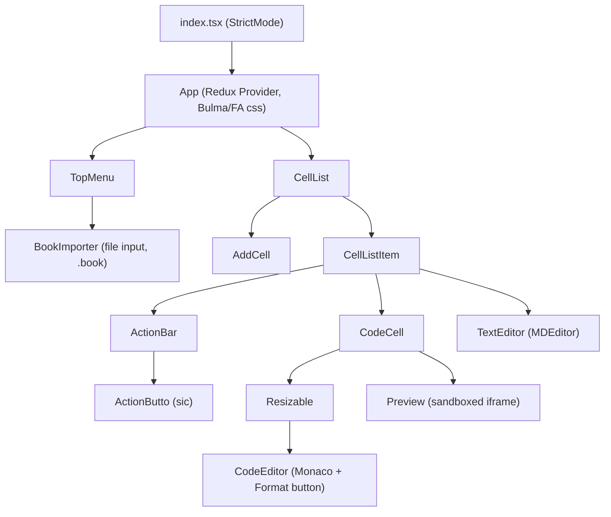
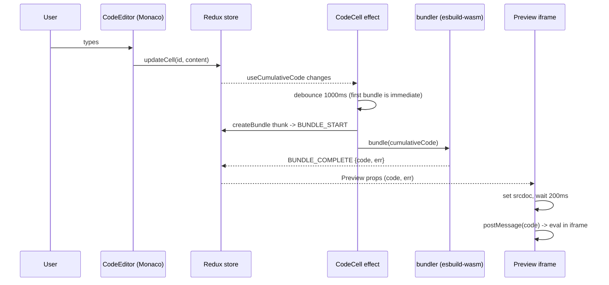
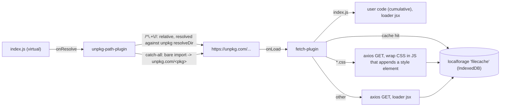

# Architecture

Describes the app as it is now (Vite 8, esbuild-wasm 0.8.27), followed by the planned
target. Keep this file current when structure or data flow changes.

## Overview

A single-page React 18 app. A "book" is an ordered list of cells (`code` or `text`). Code cells are bundled in
the browser with esbuild-wasm; bare imports are fetched from unpkg.com; output runs in a sandboxed iframe.
There is no backend; everything is stored in the browser (IndexedDB via localforage).

## Component tree



- `TopMenu`: book title input (currently `disabled`), "Save Book" (`exportCells`), "Load Book" toggle for `BookImporter`.
- `CellList`: calls `fetchCells("default")` on mount; renders `AddCell` before and after every cell.
- `CodeCell`: owns the bundling effect; shows a progress bar while `bundle` is missing/loading, else `Preview`.
- `TextEditor`: click to edit markdown; a capture-phase document click listener leaves edit mode on outside click.
- Hooks (`src/hooks`): `useActions` (bound action creators), `useTypedSelector`, `useCumulativeCode`.

## State shape (Redux)

Store: `createStore(reducers, {}, applyMiddleware(persistMiddleware, thunk))` in `src/state/store.ts`.
Reducers use immer `produce`.

```ts
RootState = {
  cells: {
    loading: boolean;
    error: string | null;
    order: string[];                       // cell ids in display order
    data: { [id: string]: Cell };          // Cell = { id, type: "code" | "text", content }
    title: string;                         // book title; also the localforage key; initial "default"
  };
  bundles: {
    [cellId: string]: { loading: boolean; code: string; err: string } | undefined;
  };
  files: {                                 // placeholder; only handles EXPORT_BOOK as a no-op
    loading: boolean; error: string | null; localFiles: string[];
  };
}
```

Action types (`src/state/action-types`): MOVE_CELL, DELETE_CELL, INSERT_CELL_AFTER, UPDATE_CELL,
UPDATE_CELLS_TITLE, BUNDLE_START, BUNDLE_COMPLETE, FETCH_CELLS(_COMPLETE|_ERROR), SAVE_CELLS_ERROR,
SAVE_CELLS_COMPLETE (unused), EXPORT_BOOK (unused) / _SUCCESS / _ERROR, IMPORT_BOOK(_COMPLETE|_ERROR).
Cell ids are 3-character random strings (`randomId` in `cellsReducer.ts`).

## Data flow: edit -> bundle -> preview



1. `useCumulativeCode(cellId)` walks `order`, and for every code cell up to and including `cellId` appends
   either the real `show` implementation (only for the target cell; it imports `_React`/`_ReactDOM` and renders
   JSX via `ReactDOM.render` or JSON/HTML into `#root`) or `var show = () => {};` for earlier cells, followed by
   the cell content. Text cells are skipped. Result: each cell sees all earlier code; only its own `show` draws.
2. `CodeCell` effect calls `createBundle(cell.id, cumulativeCode)`.
3. `bundler/index.ts` bundles `index.js` (the virtual entry) and returns `{ code, err }`; errors are caught and
   returned as `err` text.
4. `Preview` writes a fixed HTML shell into `iframe.srcdoc` (`sandbox="allow-scripts"`), then after 200 ms posts
   the bundle to it; the shell `eval`s messages and renders runtime errors in red.

## Bundler plugin pipeline

`bundler/index.ts` lazily creates one esbuild service (wasm from unpkg, version hard-coded `0.8.27`) and builds
with `bundle: true`, `write: false`, `define` for `process.env.NODE_ENV` and `global`, and a JSX factory of
`_React.createElement` / `_React.Fragment`.



Handler order in `fetch-plugin.ts`: entry file -> cache lookup (`/.*/`) -> css (`/.css$/`, unescaped dot) -> everything
else. `resolveDir` for fetched files is derived from `request.responseURL` so relative imports inside packages
resolve (unpkg redirects to concrete versions/files).

## Persistence

- Autosave: `persistMiddleware` watches MOVE_CELL, UPDATE_CELL, INSERT_CELL_AFTER, DELETE_CELL,
  UPDATE_CELLS_TITLE; debounces 250 ms and runs the `saveCells` thunk, which writes the whole `cells` slice to the
  localforage instance `cellcache` under key `cells.title`.
- Load: `fetchCells(title)` reads that key (empty "default" book if missing). Called once from `CellList` with `"default"`.
- Package cache: localforage instance `filecache`, key = resolved unpkg URL, value = esbuild `OnLoadResult`.
  No invalidation.
- Book export: `exportCells` JSON-stringifies the `cells` slice and streams it with `streamsaver` to
  `<title>.book`.
- Book import: `BookImporter` reads a `.book` file as text, `importCells` parses JSON and requires `data`, `order`,
  `title`; dispatches IMPORT_BOOK_COMPLETE (replaces the cells slice; saved to cache only once edited, via middleware).
- `getCachedBooks()` (lists `cellcache` keys) exists but is not used by any component.

## Build and deployment

Vite 8 with `@vitejs/plugin-react` (`vite.config.ts`): `base: "/js-browser/"`, root `index.html` with
`<script type="module" src="/src/index.tsx">`, static files from `public/` (favicon, icons, `manifest.json`,
`robots.txt`), output in `dist/`. `define: { global: "globalThis" }` supports browser-side libs that expect Node's
`global`; `assert` is an explicit dependency because jscodeshift/recast require it (Vite does not polyfill Node
builtins). Scripts: `dev`, `build`, `preview`. Node 24 (`.nvmrc`, `engines`), npm. The `process.env.NODE_ENV` in
`bundler/index.ts` is an esbuild `define` for user code, not a Vite env var.
Deployment (ADR-002): `.github/workflows/deploy.yml` runs on push to `main` and `workflow_dispatch`. The `build` job
checks out, sets up Node from `.nvmrc` (npm cache), runs `npm ci` and `npm run build`, then `configure-pages` and
`upload-pages-artifact` (path `dist`); the `deploy` job (needs `build`, environment `github-pages`) runs
`deploy-pages`. Permissions are `contents: read`, `pages: write`, `id-token: write`; concurrency group `pages`
(no cancel). The repo's Pages source must be set to "GitHub Actions". Site: https://anthonyflowers.github.io/js-browser/.
No tests or lint config yet.

## Target architecture (refresh)

| Area | Now | Target | Story |
|------|-----|--------|-------|
| Build/dev | Vite (done) | Vite, `base: "/js-browser/"`, root `index.html`, Node 24 + `.nvmrc` + `engines` | JSB-002 |
| Bundler | esbuild-wasm 0.8.27, `startService`, wasm URL hard-coded | current esbuild-wasm, `initialize` once + `build`, wasm URL tied to installed version, CSS regex fixed | JSB-003 |
| Editor/UI | Monaco wrapper 3.7.5, jsx-highlighter, md-editor 2.1.1, FA 5 | current majors; `onMount` API; highlighter replaced/upgraded; Redux Toolkit decision | JSB-004 |
| Deploy | GitHub Actions workflow added (pending live verification) | GitHub Actions + `deploy-pages` on push to `main` | JSB-005 |
| Quality | none | ESLint, Prettier, Vitest (reducers, plugin path resolution), CI on PRs | JSB-006 |
| Cleanup | stale files/code, outdated README | removed/refreshed; MIT LICENSE | JSB-007, 008, 009 |
| Features | single "default" book, no cell export, 2 cell types | named local books (book list/switcher over `cellcache`), per-cell file save, `css` cell type | JSB-010, 011, 012 |

Expected structural changes: `index.html` moves to repo root, build output `dist/`, a `.github/workflows/`
directory, test files beside sources, `CellTypes` gains `"css"`, `state.cells` and the `files` slice may be reworked
to track the list of local books, and `useCumulativeCode` may inject CSS cells.
