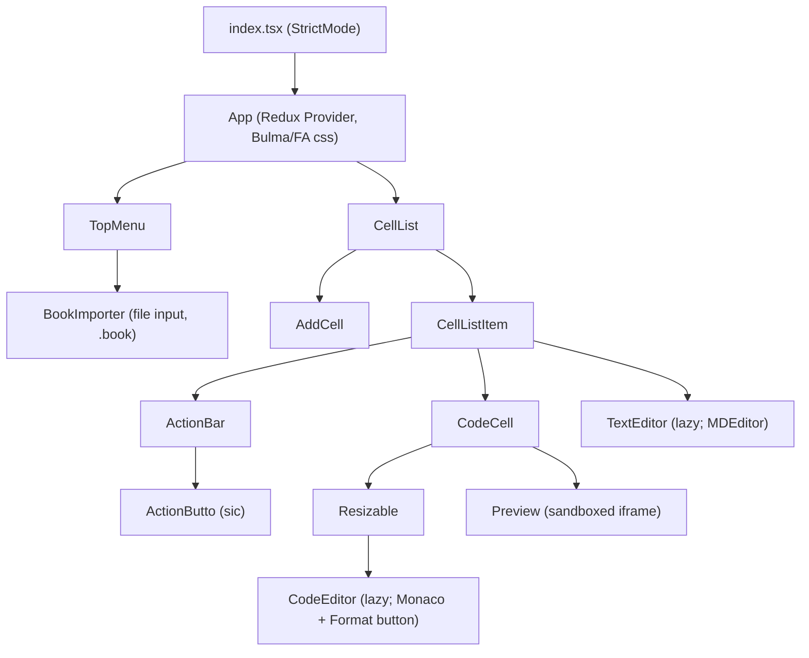
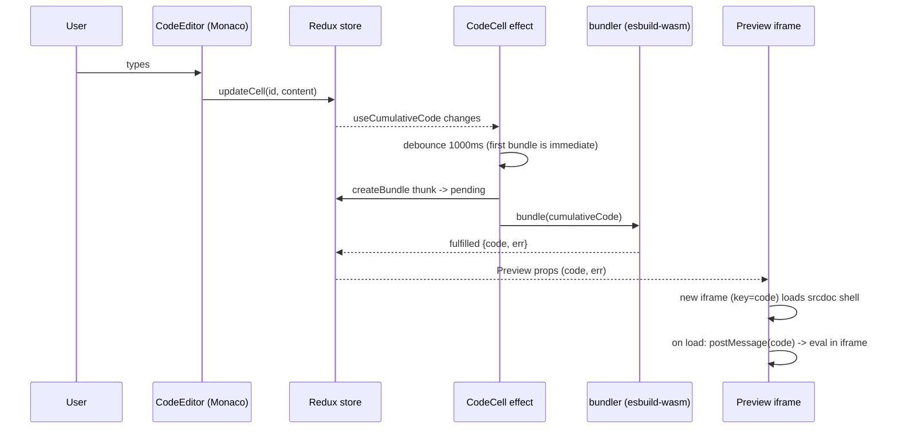
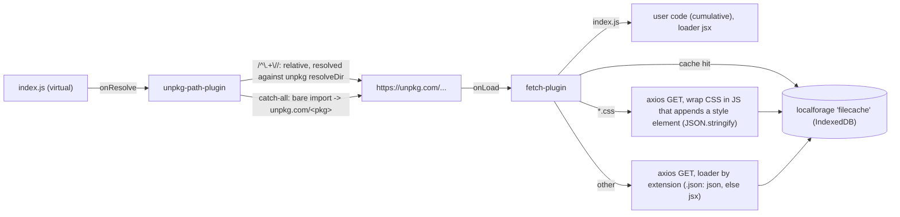

# Architecture

Describes the app as it is now (Vite 8, esbuild-wasm 0.28.2), followed by the planned
target. Keep this file current when structure or data flow changes.

## Overview

A single-page React 19 app. A "book" is an ordered list of cells (`code` or `text`). Code cells are bundled in
the browser with esbuild-wasm; bare imports are fetched from unpkg.com; output runs in a sandboxed iframe.
There is no backend; everything is stored in the browser (IndexedDB via localforage).

## Component tree



- `TopMenu`: book title input (currently `disabled`), "Save Book" (`exportCells`), "Load Book" toggle for `BookImporter`.
- Editor swipe (JSB-029): `hooks/use-page-scroll-on-touch.ts` forwards a vertical swipe on the Monaco editor to `window.scrollBy` when the editor cannot scroll further (`hooks/page-scroll.ts`); narrow layout only.
- Mobile layout (JSB-019): below 768 px (`NARROW_QUERY` in `hooks/use-media-query.ts`, mirrored by `max-width: 767px` in the CSS)
  `CodeCell` renders the editor in a vertical `Resizable` (min height 120 px) with a full-width preview below, instead of the
  side-by-side flex row with the horizontal handle; `TextEditor` edits without the live split. Touch devices
  (`pointer: coarse` / `hover: none`) get 44 px targets for `ActionBar`, `AddCell`, `TopMenu` and the Format button, always-visible
  AddCell/Format controls, a 44 px invisible hit area on resize handles (`touch-action: none`), and Monaco's iPad "show keyboard"
  widget is hidden. `TextEditor` also leaves edit mode on a touch `pointerup` outside (iOS does not fire `click` there).
- `CellList`: calls `fetchCells("default")` on mount; renders `AddCell` before and after every cell.
- `CodeCell`: owns the bundling effect; shows a progress bar while `bundle` is missing/loading, else `Preview`.
- `TextEditor`: click to edit markdown; a capture-phase document click listener leaves edit mode on outside click.
- Hooks (`src/hooks`): `useAppDispatch`, `useAppSelector` (typed react-redux hooks), `useCumulativeCode`.

## State shape (Redux)

Store: `configureStore({ reducer, middleware })` in `src/state/store.ts` (default middleware, including thunk and the
dev-only immutability/serializability checks, plus `persistListener.middleware`); exports `AppDispatch`. `RootState`
comes from the `combineReducers` in `src/state/reducers.ts`. Slices (`src/state/slices`) use `createSlice` (immer built in);
async work is `createAsyncThunk` in `src/state/thunks`.

```ts
RootState = {
  cells: {
    loading: boolean;
    error: string | null;
    order: string[];                       // cell ids in display order
    data: { [id: string]: Cell };          // Cell = { id, type: "code" | "text", content }
    title: string;                         // book title; also the localforage key; initial "default"
  };
  bundles: {
    [cellId: string]: { loading: boolean; code: string; err: string } | undefined;
  };
}
```

Actions: `cellsSlice` exports `updateCell`, `deleteCell`, `moveCell`, `insertCellAfter`, `updateTitle`; `bundlesSlice` has no
own actions and reacts to `createBundle` pending/fulfilled/rejected (keyed by `meta.arg.cellId`). `cellsSlice` also handles
`fetchCells`, `importCells` (replace order/data/title), and the rejected cases of `fetchCells`, `importCells`, `saveCells`
and `exportCells` (message in `cells.error`). Cell ids are 3-character random strings (`randomId` in `cellsSlice.ts`).

## Data flow: edit -> bundle -> preview



1. `useCumulativeCode(cellId)` walks `order`, and for every code cell up to and including `cellId` appends
   either the real `show` implementation (only for the target cell; it imports `_React` and `react-dom/client`'s `createRoot` and renders
   JSX into `#root`, or JSON/HTML) or `var show = () => {};` for earlier cells, followed by
   the cell content. Text cells are skipped. Result: each cell sees all earlier code; only its own `show` draws.
2. `CodeCell` effect dispatches `createBundle({ cellId, input: cumulativeCode })`.
3. `bundler/index.ts` bundles `index.js` (the virtual entry) and returns `{ code, err }`; errors (including network
   failures and the 120 s deadline) are caught and returned as `err` text. `bundlesSlice` stores the thunk
   `requestId` per cell and ignores a result from a superseded request.
4. `Preview` renders an iframe keyed by the bundle code (`sandbox="allow-scripts"`, fixed HTML shell in `srcDoc`) and
   posts the bundle to it from the iframe `load` event (no timer, so a slow load cannot drop it); the shell `eval`s messages and renders runtime errors in red.

## Bundler plugin pipeline

`bundler/index.ts` lazily calls `esbuild.initialize({ wasmURL })` once (memoized promise; the wasm is imported via
Vite `?url`, so it is self-hosted and always matches the installed version, ADR-009) and then `esbuild.build`s
with `bundle: true`, `write: false`, `define` for `process.env.NODE_ENV` and `global` (`globalThis`), and a JSX factory of
`_React.createElement` / `_React.Fragment`.



Reliability limits (JSB-018, ADR-019): every package request has a 30 s timeout and 3 attempts (500 ms, 1000 ms
backoff) for network errors, timeouts, 5xx and 429, but not 404; the final error reads
`Failed to fetch <url>: <reason>`. `bundle()` races the build against a 120 s deadline (`BUNDLE_DEADLINE_MS`) that also
aborts in-flight requests through an `AbortSignal` passed to `fetchPlugin`, so `bundles[cellId].loading` always returns to
false. Waiting for `esbuild.initialize` times out after 60 s (`INIT_TIMEOUT_MS`); a later bundle re-awaits the same
pending promise because esbuild refuses a second `initialize` while one is pending. IndexedDB cache calls are best effort
(3 s, failure counts as a miss).

Handler order in `fetch-plugin.ts`: entry file -> cache lookup (`/.*/`) -> css (`/\.css$/`) -> everything
else. Cache keys are prefixed with a version (`v3:`); on first use per page load, entries without the current
prefix are removed. Root-absolute imports (`/x`) resolve to `https://unpkg.com/x`. `resolveDir` for fetched files is derived from `request.responseURL` so relative imports inside packages
resolve (unpkg redirects to concrete versions/files).

## Editor (Monaco)

`src/monaco-setup.ts` (imported by `code-editor.tsx`, which `code-cell.tsx` loads with `React.lazy`, keeping Monaco out of
the entry chunk) imports `monaco-editor/editor/editor.api` plus an explicit list of contribution modules, the `javascript`
language definition and the TypeScript feature register module, instead of `editor.main` (ADR-024), and calls
`loader.config({ monaco })`, so nothing loads from a CDN (ADR-011). To restore a dropped feature, import its module there.
Workers come from Vite `?worker` imports (`monaco-editor/editor/editor.worker`, `monaco-editor/language/typescript/ts.worker`)
registered on `self.MonacoEnvironment.getWorker`; the JS/TS worker serves `javascript`, everything else uses the editor worker.
JSX highlighting and the `dark-plus` theme come from Shiki via `@shikijs/monaco` (ADR-013). `CodeEditor` uses `onMount`;
each lazy editor (`TextEditor`, `CodeEditor`) sits inside an `ErrorBoundary` (message plus Reload button), and `src/index.tsx` reloads once on `vite:preloadError`
(guarded by a `sessionStorage` flag) so a stale tab after a deploy recovers. The Format button dynamically imports `prettier/standalone` with the babel and estree plugins on first click.
The markdown cell (`TextEditor`, loaded with `React.lazy` from `cell-list-item.tsx`, empty card as fallback) uses
`@uiw/react-md-editor` 4 with `markdown-editor.css` and `data-color-mode="dark"`; its chunk (md-editor, refractor, micromark) is
only fetched when the book has a text cell. `streamsaver` is imported on the first desktop Save Book. The esbuild wasm is not
preloaded; it is fetched by the first bundle. Sizes and the per-dependency review are in `docs/done/JSB-020-reduce-bundle-size.md`.

## Persistence

- Autosave: `persist-listener.ts` (RTK listener middleware, ADR-015) matches `moveCell`, `updateCell`,
  `insertCellAfter`, `deleteCell`, `updateTitle`; debounces 250 ms and dispatches the `saveCells` thunk, which writes the whole `cells` slice to the
  localforage instance `cellcache` under key `cells.title`.
- Load: `fetchCells(title)` reads that key (empty "default" book if missing). Called once from `CellList` with `"default"`.
- Package cache: localforage instance `filecache`, key = resolved unpkg URL, value = esbuild `OnLoadResult`.
  No invalidation.
- Book export: `exportCells` JSON-stringifies the `cells` slice and passes it to `downloadBook` (`thunks/download-book.ts`,
  ADR-023): `streamsaver` on desktop, a Blob plus temporary `<a download>` on touch devices or without a service worker. The Blob is `application/octet-stream` so iOS keeps `.book`.
- Book import: `BookImporter` reads a `.book` file as text, `importCells` parses JSON and requires `data`, `order`,
  `title`; fulfils with the book (replaces order/data/title; saved to cache only once edited, via middleware).
- `getCachedBooks()` (lists `cellcache` keys) exists but is not used by any component.

## Build and deployment

Vite 8 with `@vitejs/plugin-react` (`vite.config.ts`): `base: "/js-browser/"`, root `index.html` with
`<script type="module" src="/src/index.tsx">`, static files from `public/` (favicon, icons, `manifest.json`,
`robots.txt`), output in `dist/`. Scripts: `dev`, `build`, `preview`. Node 24 (`.nvmrc`, `engines`), npm. The `process.env.NODE_ENV` in
`bundler/index.ts` is an esbuild `define` for user code, not a Vite env var.
Deployment (ADR-002): `.github/workflows/deploy.yml` runs on push to `main` and `workflow_dispatch`. The `build` job
checks out, sets up Node from `.nvmrc` (npm cache), runs `npm ci` and `npm run build`, then `configure-pages` and
`upload-pages-artifact` (path `dist`); the `deploy` job (needs `build`, environment `github-pages`) runs
`deploy-pages`. Permissions are `contents: read`, `pages: write`, `id-token: write`; concurrency group `pages`
(no cancel). The repo's Pages source must be set to "GitHub Actions". Site: https://anthonyflowers.github.io/js-browser/.

`.github/workflows/ci.yml` (JSB-006) runs on pull requests to `dev`/`main` and pushes to `dev`: job `check` (`npm ci`, `lint`, `format:check`, `typecheck`, `test`, `build` on Node from `.nvmrc`) and job `e2e` (needs `check`, see below).
Tests are Vitest (`environment: node`, config in `vite.config.ts`) in `src/**/*.test.ts` beside their sources.

## End-to-end tests (JSB-017, JSB-026, ADR-021, ADR-022)

`playwright.config.ts` runs Chromium (projects `chromium` for everything except `@mobile` features, and `mobile`, the iPhone 13 device profile in Chromium, for `e2e/features/mobile.feature`; touch drags use CDP `Input.dispatchTouchEvent` in `e2e/app.ts`) against the production build: its `webServer` runs `npm run build` (skipped with
`E2E_SKIP_BUILD`) then `vite preview` on port 4173 (base `/js-browser/`). Tests are Gherkin scenarios in `e2e/features/*.feature` with steps in `e2e/steps/` (`playwright-bdd`; `npm run test:e2e`
runs `bddgen`, which generates Playwright specs into the gitignored `.features-gen/`, then `playwright test`). Each test gets a
fresh browser context, so IndexedDB (cells and the file cache) starts empty. `e2e/mock-unpkg.ts` fulfills every
`https://unpkg.com/**` request from `e2e/fixtures/unpkg/<name>@<version>/` (stub `react`, `react-dom/client`,
`tiny-helper`, `tiny-styles`); unknown packages answer 404. Playwright cannot route the hop after a fulfilled 302, so an
unversioned request is answered directly with an `x-final-url` header and an init script makes
`XMLHttpRequest.responseURL` report it (the fetch plugin derives `resolveDir` from `responseURL`). Options: `stall`
(never answer), `slow`/`delayMs`, and `requestTimeoutMs` (caps the XHR `timeout` the app sets, so the 30 s x 3 attempts
path ends in seconds). `e2e/app.ts` holds the page helpers; the preview is reached with `frameLocator`. The `e2e/` folder
has its own `tsconfig.json` (Node types), checked by `npm run typecheck`. In CI the `e2e` job (needs `check`) installs
Chromium with `npx playwright install --with-deps chromium`, runs `npm run test:e2e` and uploads `playwright-report/`
on failure.

## Target architecture (refresh)

| Area | Now | Target | Story |
|------|-----|--------|-------|
| Build/dev | Vite (done) | Vite, `base: "/js-browser/"`, root `index.html`, Node 24 + `.nvmrc` + `engines` | JSB-002 |
| Bundler | esbuild-wasm 0.28.2, `initialize` once + `build`, wasm via Vite `?url` (done) | current esbuild-wasm, `initialize` once + `build`, wasm URL tied to installed version, CSS regex fixed | JSB-003 |
| Editor/UI | Monaco 0.57 bundled locally (wrapper 4.7, Shiki highlighting), md-editor 4, Prettier 3, React 19, FA 7 (done) | current majors | JSB-004 |
| Deploy | GitHub Actions workflow added (pending live verification) | GitHub Actions + `deploy-pages` on push to `main` | JSB-005 |
| Quality | ESLint, Prettier, Vitest, CI on PRs (done) | same | JSB-006 |
| State | Redux Toolkit slices, thunks, listener middleware (done) | same | JSB-014 |
| Cleanup | stale files/code, outdated README | removed/refreshed; MIT LICENSE | JSB-007, 008, 009 |
| Features | single "default" book, no cell export, 2 cell types | named local books (book list/switcher over `cellcache`), per-cell file save, `css` cell type | JSB-010, 011, 012 |

Expected structural changes: `index.html` moves to repo root, build output `dist/`, a `.github/workflows/`
directory (deploy.yml, ci.yml), test files beside sources, `CellTypes` gains `"css"`, `state.cells` may be reworked
to track the list of local books, and `useCumulativeCode` may inject CSS cells.
