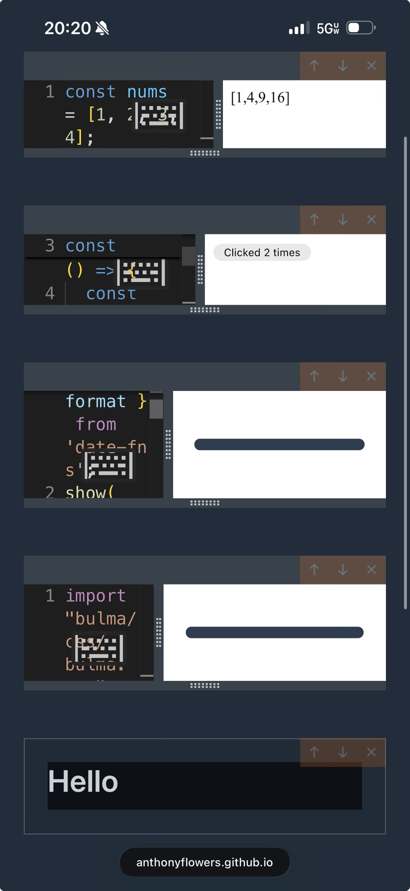
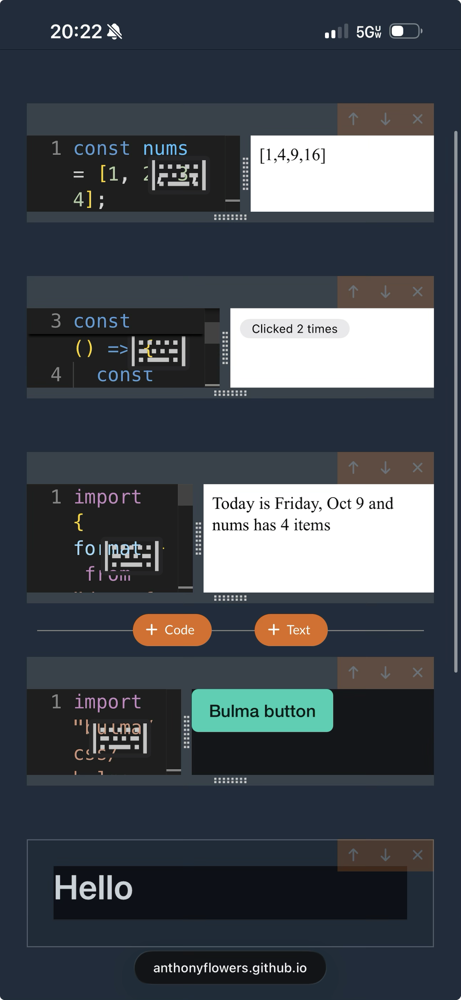

# JSB-016: Code cell preview sometimes stays on the loading bar

- **Type:** Bug
- **Priority:** High
- **Depends on:** JSB-018

## Description

As a user, I want every code cell's preview to finish bundling and render so that I am not left looking at a loading bar
with no output or error.

Reported by the owner on the live site (iPhone, mobile Safari, 5G) right after the JSB-004/JSB-014 release on 2026-10-10.
A book with four code cells and one text cell:

1. `show(nums.map(...))` rendered `[1,4,9,16]`.
2. A React `useState` counter rendered and worked.
3. `import { format } from "date-fns"` stayed on the grey indeterminate progress bar.
4. `import "bulma/css/bulma.css"` stayed on the grey indeterminate progress bar.

The owner then deleted cells 3 and 4 and added them back with the same code; the new cells rendered
correctly ("Today is Friday, Oct 9 and nums has 4 items" and a styled Bulma button). No error was shown in either state.

| Stuck | Loaded later |
|-------|--------------|
|  |  |

Steps to reproduce: not yet known. Likely conditions are the first import of a package that is not yet cached in
IndexedDB, on a slow or mobile connection. Workaround: delete the cell and add it again.

## Acceptance Criteria

- [x] Root cause identified and documented in Notes (reproduced locally, e.g. with throttled or stalled network for unpkg)
- [x] A bundle that cannot complete ends in a visible error in the preview instead of an indefinite loading bar
- [x] A slow but progressing first fetch still completes and renders
- [x] Regression test covering the failure mode (thunk/plugin level)
- [x] Verified on the live site on mobile after release

## Notes

Relationship: JSB-018 (timeouts, retries, clear errors) is the main fix and is done first; this story depends on it. This story remains for root-cause identification, the regression test of the original failure mode, and the live-site check on mobile. Part of the stability sweep (priority raised to High).

The grey bar is the Bulma `progress` element in `src/components/code-cell.tsx`, shown while `!bundle || bundle.loading`.

Hypotheses to check:

- **Slow first fetch:** `date-fns` resolves to many module files and `bulma.css` is about 750 KB; each unpkg file is
  fetched sequentially by `fetch-plugin` with no progress feedback, so a slow mobile connection could look stuck.
- **Hung request:** axios in `fetch-plugin` has no timeout, so a stalled unpkg request keeps `createBundle` pending and
  the cell on the loading bar forever, until a later edit or reload starts a new bundle.
- **Concurrent bundling on load:** after a reload every cell bundles at once and the esbuild `initialize` promise is
  shared; check for a race or a bundle result arriving for an outdated input.
- **Missing dispatch:** a cell whose bundle is never started (`bundle` undefined) also shows the bar; check the
  debounce/effect in `code-cell.tsx` for a path that skips `createBundle`.

Recovery (owner, 2026-10-10): the stuck cells recovered only after being deleted and re-added. A new cell gets a new id
and a fresh `createBundle` run, and by then the packages were likely cached. This points away from "just slow" and
toward a bundle for the original cell ids that never settled (hung request) or was never started; it is not yet known
whether waiting longer would have recovered them.

### Investigation (2026-10-10)

Reproduced in Chromium against `npm run preview` with unpkg intercepted (script in the session scratchpad). Book: plain
JS, React counter, `import { format } from "date-fns"`, a text cell and `import "bulma/css/bulma.css"`; saved, then the
page reloaded so every cell bundles at once, like the owner's reload.

| Scenario | Before JSB-018 | After |
|----------|----------------|-------|
| Normal | all four cells render | all four render |
| unpkg stalls for date-fns and bulma (route never answers) | cells 1 and 2 render; cells 3 and 4 stay on the grey bar for 150 s and beyond, no error | cells 3 and 4 end in the preview error `Failed to fetch https://unpkg.com/date-fns: timed out after 30s (3 attempts)` after about 92 s |
| Slow (every date-fns/bulma file delayed 3 s) | still loading at 30 s | renders by 60 s |

Root cause: a hung unpkg request. `axios.get` in `fetch-plugin.ts` had no timeout, so `createBundle` never settled and
`bundles[cellId].loading` stayed true forever. This matches the owner's observation exactly (earlier cells fine, the two
cells needing uncached packages stuck, no error, recovery only by creating new cells, which get a fresh bundle run once the
packages are cached). Waiting longer would not have recovered them. On iOS Safari an IndexedDB call that never returns
(`removeStaleEntries` is memoized for the page, so one hang blocks every later bundle) would look the same; that path is now
also bounded by the cache timeout and the bundle deadline.

Checked and ruled out as the cause:

- (a) `code-cell.tsx` effect: the first bundle for a cell is dispatched immediately and later ones after the 1 s debounce, with
  `bundle` read through the closure only to pick the path; I found no route that skips `createBundle` for a cell with content
  (cells loaded by `fetchCells` after reload mount with their content and bundle at once, verified in the reload run).
  StrictMode (dev only) runs the first effect twice and dispatches two bundles; the second supersedes the first and neither is lost.
- (a) Stale results: a real defect found. `bundlesSlice` let any settled bundle overwrite the cell's entry, so an older
  bundle finishing after a newer one started or finished replaced newer output (and cleared the newer one's `loading`
  early, or restored stale code). Fixed by storing the thunk `requestId` in the entry and ignoring superseded results;
  regression tests in `bundlesSlice.test.ts` and `bundleThunks.test.ts`.
- (b) Concurrent `esbuild.initialize`: no race. `ensureInitialized` memoizes one promise that all concurrent bundles share
  (verified in the reload run, 4 bundles at once). The one gap was that a hung wasm download would hang every cell; it now times out
  after 60 s and a retry re-awaits the same pending promise, since esbuild throws on a second `initialize` while one is pending
  (test in `bundler/index.test.ts`).
- Slow-but-progressing: unpkg files are fetched in parallel by esbuild per dependency level, each with its own 30 s timeout,
  so a slow connection does not trip the timeout unless a single file needs more than 30 s.

Still open: the live-site check on mobile after release.

Live check (owner, iPhone, 2026-10-10, after the PR #6 release): a first-time package import renders, and an invalid
package shows `Failed to fetch https://unpkg.com/date-fns-bad: network error (Network Error) (3 attempts)` instead of
a stuck loading bar ([screenshot](../stories/assets/JSB-029-import-error.png)).
